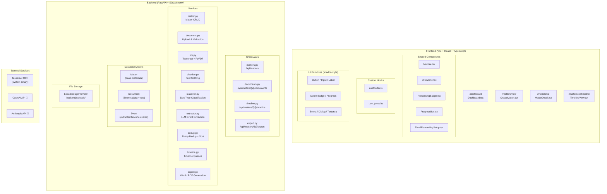
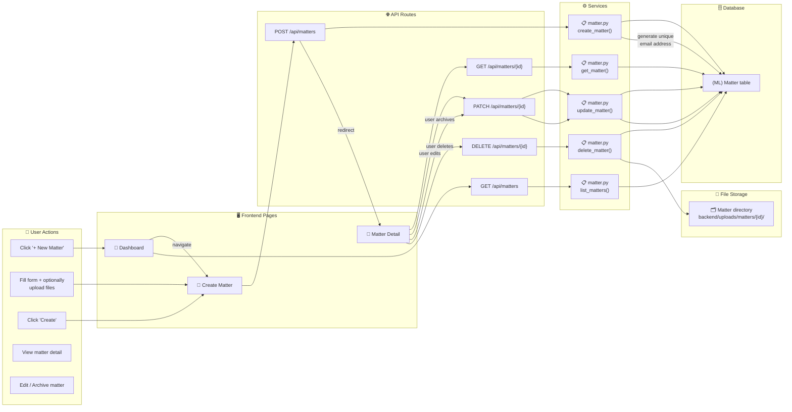
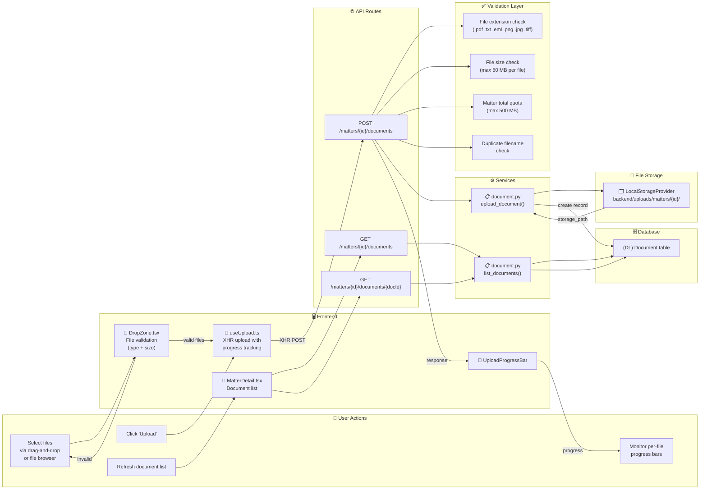
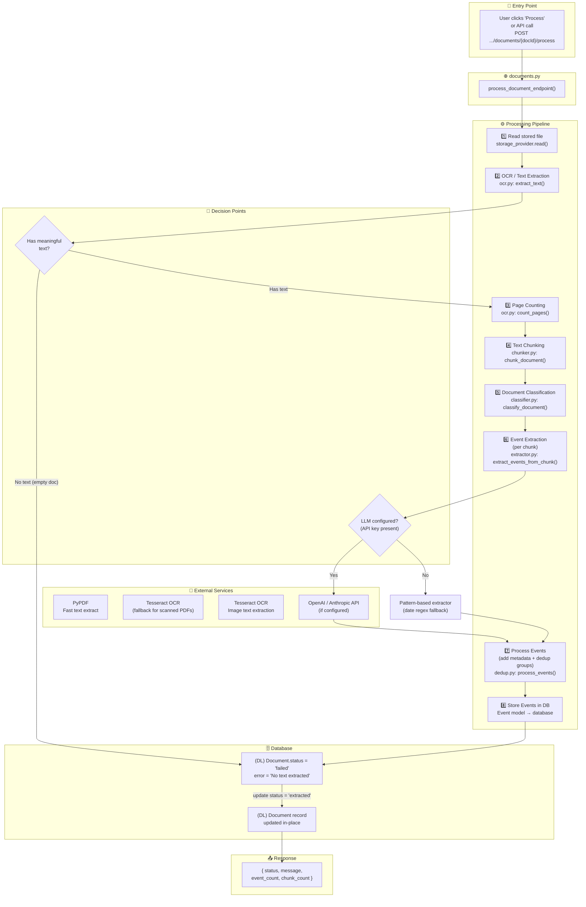
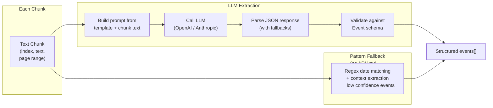
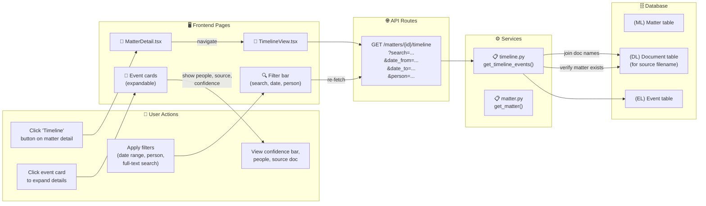
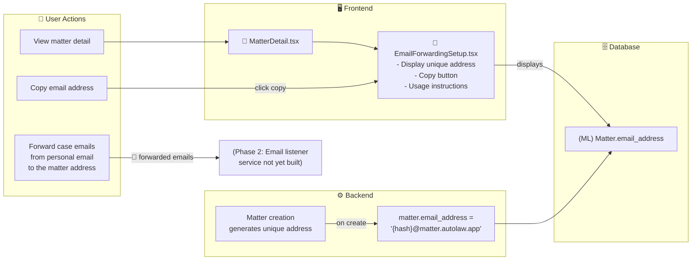
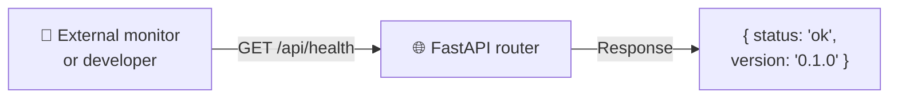
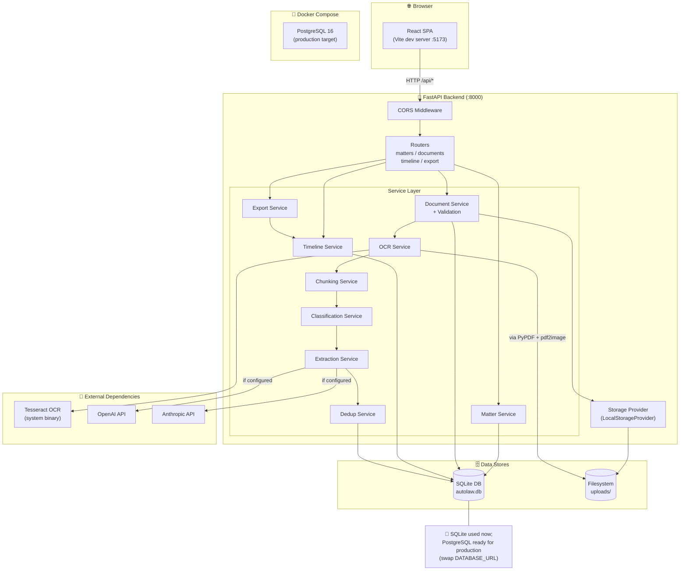

# AutoLaw Phase 1 — Workflow Diagrams

> **Phase 1: Intake + Chronology Builder**
> These diagrams document every workflow in the system, showing how data flows
> through frontend pages, API routes, backend services, database models, and
> external services.

---

## Table of Contents

1. [Component Map — All Parts of the System](#1-component-map--all-parts-of-the-system)
2. [Matter Lifecycle](#2-matter-lifecycle)
3. [Document Ingestion](#3-document-ingestion)
4. [Document Processing Pipeline](#4-document-processing-pipeline)
5. [Timeline Browsing](#5-timeline-browsing)
6. [Timeline Export](#6-timeline-export)
7. [Email Ingestion Setup](#7-email-ingestion-setup)
8. [Health Check](#8-health-check)
9. [Full System Architecture](#9-full-system-architecture)

---

## 1. Component Map — All Parts of the System



---

## 2. Matter Lifecycle

Create, view, update, archive, and delete legal matters.

### Flow



### Entry Points

| Action | URL | Method | Frontend |
|---|---|---|---|
| List all matters | `/dashboard` | `GET /api/matters` | `Dashboard.tsx` |
| Create new matter | `/matters/new` | `POST /api/matters` | `CreateMatter.tsx` |
| View matter detail | `/matters/:id` | `GET /api/matters/{id}` | `MatterDetail.tsx` |
| Update matter | — | `PATCH /api/matters/{id}` | `MatterDetail.tsx` |
| Delete matter | — | `DELETE /api/matters/{id}` | `MatterDetail.tsx` |

### Data Model (Matter)

```
id:         UUID string (PK)
title:      string (required)
case_number: string (optional)
case_type:  "Civil" | "Criminal" | "Family" | ...
jurisdiction: string (optional)
description: text (optional)
status:     "active" | "archived"
email_address: string (auto-generated)
created_at: datetime
updated_at: datetime
```

---

## 3. Document Ingestion

Upload, validate, store, and list documents within a matter.

### Flow



### File Type Validation

| Extension | `original_type` | Allowed |
|---|---|---|
| `.pdf` | `pdf` | ✅ |
| `.txt` | `txt` | ✅ |
| `.eml` | `email` | ✅ |
| `.png`, `.jpg`, `.jpeg`, `.tiff`, `.tif`, `.bmp` | `image` | ✅ |
| Everything else | — | ❌ (400 error) |

### Data Model (Document)

```
id:                UUID string (PK)
matter_id:         UUID string (FK → matters.id)
filename:          string
original_type:     "pdf" | "txt" | "email" | "image"
storage_path:      string (relative to uploads/)
file_size_bytes:   integer
ocr_text:          text (nullable, populated by OCR)
extracted_text:    text (nullable, populated after process)
doc_type:          "contract" | "email" | "police_report" | "medical_record" |
                   "correspondence" | "other" (nullable)
processing_status: "pending" | "uploading" | "ocr_pending" | "ocr_done" |
                   "classifying" | "classified" | "extracting" | "extracted" |
                   "failed"
processing_error:  text (nullable)
page_count:        integer (nullable)
uploaded_at:       datetime
```

---

## 4. Document Processing Pipeline

The core Gen AI pipeline: OCR → Chunk → Classify → Extract → Deduplicate → Store.

Triggered by `POST /api/matters/{id}/documents/{docId}/process`.



### Extraction Detail



### Processing Status Progression

```
pending → ocr_pending → ocr_done → classifying → extracting → extracted
                                                                   ↓
                                                               (on error) failed
```

### Event Data Model

```
id:                  UUID string (PK)
matter_id:           UUID string (FK → matters.id)
source_document_id:  UUID string (FK → documents.id)
source_chunk_index:  integer (nullable)
date:                string (ISO 8601 or partial)
date_precision:      "exact" | "month" | "year" | "range"
date_end:            string (nullable, for date ranges)
title:               string
description:         text (nullable)
people:              text (JSON array, nullable)
doc_reference:       string (page/para ref, nullable)
confidence:          float (0.0–1.0)
dedup_group:         string (hash for dedup, nullable)
created_at:          datetime
```

---

## 5. Timeline Browsing

View, filter, and explore extracted events in a chronological timeline.

### Flow



### Filter Parameters

| Parameter | Location | Effect |
|---|---|---|
| `search` | Query string | Full-text search on `title` and `description` |
| `date_from` | Query string | Filter events on or after this date (ISO 8601) |
| `date_to` | Query string | Filter events on or before this date (ISO 8601) |
| `person` | Query string | Filter by person name (substring match on `people` JSON) |

### Timeline Visual Encoding

| Precision | Card Left-Border Color | Meaning |
|---|---|---|
| `exact` | Blue (primary) | Full date known |
| `month` | Light blue | Only month/year known |
| `year` | Yellow | Only year known |
| `range` | Purple | Event spans a date range |

---

## 6. Timeline Export

Export the filtered timeline to Word (.docx) or PDF.

### Flow



```mermaid
flowchart LR
    subgraph User["👤 User Actions"]
        A1["Click 'Export to Word'"]
        A2["Click 'Export to PDF'"]
        A3["Download generated file"]
    end

    subgraph Frontend["🖥 Frontend"]
        F1["📄 TimelineView.tsx<br/>Export buttons"]
        F2["🔄 exportTimeline()<br/>hook function"]
    end

    subgraph API["🌐 API Routes"]
        B1["GET /matters/{id}/export?format=docx"]
        B2["GET /matters/{id}/export?format=pdf"]
    end

    subgraph Services["⚙ Services"]
        S1["📋 timeline.py<br/>get_timeline_events()"]
        S2["📊 export.py<br/>export_to_docx()"]
        S3["📊 export.py<br/>export_to_pdf()"]
    end

    subgraph Generators["📄 Document Generation"]
        G1["🐍 python-docx<br/>Timeline table<br/>Legal formatting<br/>(Times New Roman,<br/>margins, headers)"]
        G2["🐍 fpdf2<br/>Page breaks<br/>Professional layout<br/>(same content)"]
    end

    subgraph Output["📥 Output"]
        O1["📎 timeline_{id}.docx"]
        O2["📎 timeline_{id}.pdf"]
    end

    A1 --> F1
    A2 --> F1
    F1 --> F2
    F2 -->|format=docx| B1
    F2 -->|format=pdf| B2

    B1 --> S1
    B2 --> S1
    S1 -->|fetch events| DB[("🗄 DB")]

    B1 --> S2
    S2 --> G1
    G1 --> O1
    O1 -->|download| A3

    B2 --> S3
    S3 --> G2
    G2 --> O2
    O2 -->|download| A3

    subgraph ExportFormat["Export Document Structure"]
        T["📄 Document"]
        H["─ Header: 'Chronology of Events'"]
        M["─ Matter title + generation date"]
        L["─ Separator line"]
        L1["1️⃣ 2024-01-15"]
        D1["  Event title"]
        D1D["  Description"]
        P1["  People involved"]
        S1R["  Source: contract.pdf · Conf: 95%"]
        L2["  2️⃣ 2024-03-20"]
        D2["  ..."]
        F["─ Footer disclaimer"]
    end
```

### Error Handling

| Scenario | Response |
|---|---|
| Matter not found | `404` — "Matter not found" |
| No events to export | `404` — "No timeline events found. Process documents first." |
| Unsupported format | `400` — "Unsupported format. Use 'docx' or 'pdf'." |

---

## 7. Email Ingestion Setup

Configure email forwarding so case-related emails are auto-attached to a matter.

### Flow



### Current Status

The email address is **generated and stored** during matter creation. The
email listener service (IMAP/POP3 polling, inbound webhook) is **planned for
Phase 2**. For now, the UI shows the address and setup instructions so users
can start forwarding emails — they'll be processed when the listener is built.

---

## 8. Health Check

Simple liveness probe for the backend.



---

## 9. Full System Architecture

End-to-end view of all components, data stores, and external services.



---

## Index of All API Endpoints

| Method | Path | Purpose | Request | Response |
|---|---|---|---|---|
| `GET` | `/api/health` | Health check | — | `{status, version}` |
| `POST` | `/api/matters` | Create matter | `{title, case_number?, case_type?, ...}` | `MatterResponse` (201) |
| `GET` | `/api/matters` | List matters | `?search=&status=&skip=&limit=` | `{matters[], total}` |
| `GET` | `/api/matters/{id}` | Get matter | — | `MatterResponse` |
| `PATCH` | `/api/matters/{id}` | Update matter | `{title?, status?, ...}` | `MatterResponse` |
| `DELETE` | `/api/matters/{id}` | Delete matter | — | 204 No Content |
| `POST` | `/api/matters/{id}/documents` | Upload files | `multipart files[]` | `DocumentResponse[]` (201) |
| `GET` | `/api/matters/{id}/documents` | List documents | `?skip=&limit=` | `{documents[], total}` |
| `GET` | `/api/matters/{id}/documents/{docId}` | Get document | — | `DocumentResponse` |
| `POST` | `/api/matters/{id}/documents/{docId}/process` | Process document | — | `{status, message, ...}` |
| `GET` | `/api/matters/{id}/timeline` | Get timeline | `?search=&date_from=&date_to=&person=` | `{events[], total_events}` |
| `GET` | `/api/matters/{id}/export` | Export timeline | `?format=docx\|pdf` | Binary file download |

## Index of All Frontend Routes

| Path | Page Component | Description |
|---|---|---|
| `/` | Redirect → `/dashboard` | Root redirect |
| `/dashboard` | `Dashboard.tsx` | Matter cards, search, filter, "New Matter" CTA |
| `/matters/new` | `CreateMatter.tsx` | Case metadata form + drag-and-drop upload |
| `/matters/:id` | `MatterDetail.tsx` | Document list, status badges, upload more, process, email setup |
| `/matters/:id/timeline` | `TimelineView.tsx` | Interactive timeline with filters and export |

## Index of All Database Models

| Model | Table | Key Fields | Relationships |
|---|---|---|---|
| `Matter` | `matters` | `id`, `title`, `status`, `email_address` | → `documents[]`, → `events[]` |
| `Document` | `documents` | `id`, `matter_id` (FK), `filename`, `processing_status`, `storage_path` | → `matter`, → `events[]` |
| `Event` | `events` | `id`, `matter_id` (FK), `source_document_id` (FK), `date`, `title`, `people` | → `matter`, → `source_document` |

---

> **Generated for Phase 1 completion review.**
> Workflows 1–8 are fully implemented. Email ingestion (workflow 7) has the
> setup UI and data model complete; the background email listener is deferred
> to Phase 2.
